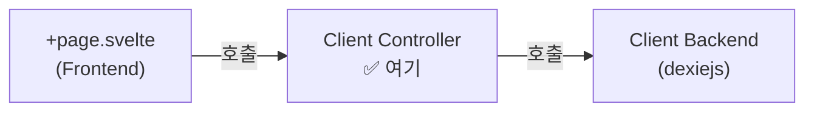

# AI 코딩 가이드: Client Controller 레이어

이 가이드는 `src/lib/client/controller` 디렉토리에서 **클라이언트 비즈니스 로직**을 구현할 때 따라야 할 규칙을 정의합니다.

## 1. 역할 정의

Client Controller는 **클라이언트 Backend(DexieJS 등)의 함수들을 조합하여 비즈니스 목적을 달성**하는 레이어입니다.



### 핵심 원칙
1.  **Client Backend만 import**: `src/lib/client/backend/` 하위 모듈만 가져올 수 있습니다.
2.  **Server 코드 금지**: `$lib/server/`를 import하면 빌드 에러가 발생합니다.
3.  **UI 무지**: Svelte 컴포넌트, DOM, store에 대해 몰라야 합니다.

## 2. 디렉토리 구조

### 규칙
1.  **폴더 생성**: 기능 단위(feature/domain)로 폴더를 생성합니다.
2.  **파일 생성**: 해당 폴더 안에 `_.ts` 파일을 생성합니다.
3.  **클래스 명명**: 폴더 이름을 **PascalCase** + `Controller`로 명명합니다.

### 구조 예시
```
src/lib/client/controller/
├── post/                  ← 게시글 관련 클라이언트 로직
│   └── _.ts               ← PostController 클래스
├── settings/              ← 설정 관련 클라이언트 로직
│   └── _.ts               ← SettingsController 클래스
```

## 3. Controller 클래스 구현

### 표준 패턴

```typescript
// src/lib/client/controller/post/_.ts

import { PostDexie } from '$lib/client/backend/dexiejs/post/_';
import { Post } from '$lib/client/backend/dexiejs/post/_';

export class PostController {

  // 1. 로컬 저장
  static async savePostLocally(
    title: string,
    content: string
  ): Promise<Post> {
    await PostDexie.ready();

    const post = new Post();
    post.docId = crypto.randomUUID();
    post.title = title;
    post.content = content;
    post.createdAt = new Date();

    await PostDexie.upsert(post);
    return post;
  }

  // 2. 로컬 조회
  static async getLocalPosts(): Promise<Post[]> {
    await PostDexie.ready();
    return await PostDexie.getAll();
  }

  // 3. 복합 로직
  static async getRecentDrafts(limit: number): Promise<Post[]> {
    await PostDexie.ready();
    const all = await PostDexie.getAll();
    return all
      .filter(p => !p.isPublished)
      .sort((a, b) => b.createdAt.getTime() - a.createdAt.getTime())
      .slice(0, limit);
  }
}
```

### Server Controller와의 차이점

| 항목 | Server Controller | Client Controller |
|---|---|---|
| Backend 대상 | DynamoDB, WorkerKV | DexieJS (IndexedDB) |
| 호출 위치 | `+page.server.ts` | `+page.svelte` |
| `platform` 파라미터 | 필요 (Cloudflare) | 불필요 |
| `ready()` 호출 | 불필요 | **필수** (Dexie 초기화) |

## 4. Frontend에서의 호출

```svelte
<!-- src/routes/posts/+page.svelte -->
<script>
  import { PostController } from '$lib/client/controller/post/_';
  import { onMount } from 'svelte';

  let posts = [];

  onMount(async () => {
    posts = await PostController.getLocalPosts();
  });
</script>
```

> [!CAUTION]
> **Frontend에서 `$lib/client/backend/`를 직접 호출하는 것은 절대 금지입니다.** 반드시 Client Controller를 경유하세요.
