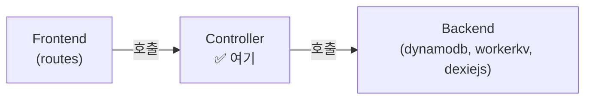

# AI 코딩 가이드: Controller 레이어

이 가이드는 `src/lib/server/controller` 및 `src/lib/client/controller` 디렉토리에서 **비즈니스 로직(Use Case)**을 구현할 때 따라야 할 규칙을 정의합니다.

## 1. 역할 정의

Controller는 **Backend의 순수 함수들을 조합하여 비즈니스 목적을 달성**하는 레이어입니다.



### 핵심 원칙
1.  **Backend만 import**: `backend` 모듈의 함수/클래스만 가져올 수 있습니다.
2.  **Frontend 무지**: Controller는 Svelte 컴포넌트, route, request/response 객체에 대해 **전혀 몰라야** 합니다.
3.  **순수 비즈니스 로직**: HTTP, HTML, UI 관련 코드가 Controller에 존재해서는 안 됩니다.

## 2. 디렉토리 구조

### 규칙
1.  **폴더 생성**: 기능 단위(feature/domain)로 폴더를 생성합니다.
2.  **파일 생성**: 해당 폴더 안에 `_.ts` 파일을 생성합니다.
3.  **클래스 명명**: 폴더 이름을 **PascalCase** + `Controller`로 명명합니다.

### 구조 예시
```
src/lib/server/controller/
├── post/                  ← 게시글 관련 비즈니스 로직
│   └── _.ts               ← PostController 클래스
├── auth/                  ← 인증 관련 비즈니스 로직
│   └── _.ts               ← AuthController 클래스
```

## 3. Controller 클래스 구현

### 표준 패턴

```typescript
// src/lib/server/controller/post/_.ts

import { PostDynamoDb } from '$lib/server/backend/dynamodb/post/_.ts';
import { Post } from '$lib/server/backend/dynamodb/post/_.ts';

export class PostController {

  // 1. 생성
  static async createPost(
    title: string,
    content: string,
    platform?: any
  ): Promise<Post> {
    const post = new Post();
    post.docId = crypto.randomUUID();
    post.title = title;
    post.content = content;
    post.createdAt = new Date();

    await PostDynamoDb.upsert(post, platform);
    return post;
  }

  // 2. 조회
  static async getPost(
    docId: string,
    platform?: any
  ): Promise<Post | null> {
    return await PostDynamoDb.get(docId, platform);
  }

  // 3. 복합 비즈니스 로직 (여러 Backend 조합)
  static async publishPost(
    docId: string,
    platform?: any
  ): Promise<boolean> {
    const post = await PostDynamoDb.get(docId, platform);
    if (!post) return false;

    post.isPublished = true;
    post.publishedAt = new Date();
    await PostDynamoDb.upsert(post, platform);

    return true;
  }
}
```

### 핵심 규칙 요약

| 규칙 | 설명 |
|---|---|
| **입력** | 기본 타입(string, number 등) 또는 Backend DTO를 받음 |
| **출력** | Backend DTO 또는 기본 타입을 반환 |
| **금지** | `Request`, `Response`, `cookies`, Svelte store 등 프레임워크 객체 사용 금지 |
| **허용** | 여러 Backend 모듈을 조합, 조건 분기, 데이터 가공 |

## 4. Frontend에서의 호출

### Server Controller → `+page.server.ts`에서 호출

```typescript
// src/routes/posts/+page.server.ts
import { PostController } from '$lib/server/controller/post/_';

export const load = async ({ platform }) => {
  const posts = await PostController.getAllPosts(platform);
  return { posts };
};

export const actions = {
  create: async ({ request, platform }) => {
    const data = await request.formData();
    const title = data.get('title') as string;
    const content = data.get('content') as string;

    await PostController.createPost(title, content, platform);
  }
};
```

### Client Controller → `+page.svelte`에서 호출

```typescript
// src/routes/posts/+page.svelte
<script>
  import { PostController } from '$lib/client/controller/post/_';

  async function loadLocalPosts() {
    const posts = await PostController.getAllLocalPosts();
    // ...
  }
</script>
```

> [!CAUTION]
> **Frontend에서 Backend를 직접 호출하는 것은 절대 금지입니다.** 반드시 Controller를 경유하세요.
